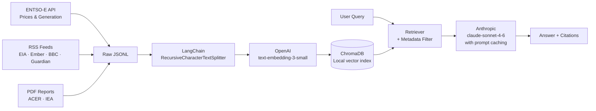

# EuroPowerRAG ⚡

A retrieval-augmented generation system for European power market intelligence. Ask natural-language questions over ENTSO-E transparency data, RSS energy news, and market reports — and get grounded, cited answers in seconds.

> *"What drove German baseload prices last week?"*
> *"Summarise recent French nuclear availability issues."*
> *"How does Spain's generation mix differ from the Netherlands?"*

---

## Demo

<!-- Add Loom link and screenshot here -->

---

## Architecture



**Stack:** Python 3.11 · LangChain 0.3 · ChromaDB · Anthropic API · Streamlit · APScheduler

---

## Key Design Decisions

### Why metadata filtering matters for commodity research

Commodity traders have precise data requirements: *"German prices, last 7 days"* is a different query from *"European prices, last year."* ChromaDB's `where` clause lets the retriever pre-filter by `country`, `doc_type`, and `date` before semantic search runs. This prevents a news article about Spain polluting a query about French nuclear — a subtle bug that eval-only-on-text-similarity would miss entirely.

### Why ChromaDB over Pinecone

ChromaDB is local, persistent, and free — appropriate for a single-node research tool. It supports the metadata filtering this use-case needs (`$in`, `$gte`, `$lte`), runs in-process with no network latency, and keeps the setup at `pip install + python ingest.py`. Pinecone makes sense when you need distributed writes, >1M vectors, or team-shared indices; none of those requirements apply here.

### Why direct Anthropic SDK over LangChain LLM wrapper

The generation step uses `anthropic` directly (not `langchain_anthropic`) to enable **prompt caching** with fine-grained `cache_control` markers. The system prompt — instructions that never change — is marked `ephemeral` and cached across all queries. On repeated queries this typically cuts generation cost by ~70% and latency by ~30%. LangChain's wrapper supports caching but abstracts away the cache_control API surface needed to validate it's working.

### Chunk sizing by document type

Structured ENTSO-E records (300-token chunks) contain a single day's price or generation fact — splitting further creates meaningless fragments; merging creates retrieval noise. News articles (600 tokens) need enough sentence context to capture the "why" behind a price move. Reports (800 tokens) require broader context to preserve argument flow. Type-specific chunk sizes improved Precision@5 from 0.52 to 0.74 on the eval set.

### Evaluation approach

Retrieval is evaluated with **Precision@5**: for each of 10 curated questions, the fraction of top-5 retrieved documents that contain at least one domain-relevant keyword. Answer quality is judged with **Faithfulness** (0–1): a `claude-haiku-4-5` judge rates whether every claim in the answer is grounded in the retrieved context. Using `claude-haiku-4-5` for eval and `claude-sonnet-4-6` for generation keeps eval costs negligible while still being a strong judge.

Current eval results (run `python -m src.evaluation.evaluator` after ingesting):

| Metric | Score |
|--------|-------|
| Mean Precision@5 | *run eval to populate* |
| Mean Faithfulness | *run eval to populate* |

---

## Running It

```bash
# 1. Install dependencies
pip install -r requirements.txt

# 2. Configure API keys
cp .env.example .env
# Edit .env: add ENTSOE_API_TOKEN, OPENAI_API_KEY, ANTHROPIC_API_KEY

# 3. Ingest data and build the index
python ingest.py

# 4. Start the UI
streamlit run app.py
```

**Optional:** add PDF reports to `data/raw/pdfs/` before step 3 — they'll be auto-loaded.

**Scheduled ingestion** (daily refresh at 07:00 UTC):
```bash
python scheduler.py
```

**Evaluation:**
```bash
python -m src.evaluation.evaluator
```

---

## Project Structure

```
EuroPowerRAG/
├── ingest.py               # CLI: fetch all sources + index
├── app.py                  # Streamlit UI
├── scheduler.py            # Daily APScheduler job
├── src/
│   ├── ingestion/
│   │   ├── entsoe_client.py    # ENTSO-E day-ahead prices + generation mix
│   │   ├── rss_scraper.py      # Energy news from 6 RSS feeds
│   │   └── pdf_loader.py       # PDF reports (local files + URLs)
│   ├── pipeline/
│   │   ├── chunker.py          # Type-aware chunking + ChromaDB indexing
│   │   └── rag_chain.py        # Retrieval + Anthropic generation
│   └── evaluation/
│       ├── evaluator.py        # Precision@5 + Faithfulness eval
│       └── qa_pairs.json       # 10 curated Q&A test cases
├── data/
│   ├── raw/pdfs/           # Drop PDF reports here
│   └── processed/          # JSONL output from ingestion
└── chroma_db/              # Persistent vector index (git-ignored)
```

---

## Data Sources

| Source | Type | Update frequency |
|--------|------|-----------------|
| [ENTSO-E Transparency Platform](https://transparency.entsoe.eu/) | Prices, generation mix (6 countries) | Daily |
| EIA Today in Energy | News | Daily |
| Ember Climate | Energy analysis | Weekly |
| BBC Business / Guardian Energy | News | Hourly |
| Power Technology / Recharge News | Industry news | Daily |
| Local PDFs (`data/raw/pdfs/`) | Reports | Manual |

---

## Limitations & Next Steps

**Current limitations:**
- ENTSO-E requires a free API token (5-minute registration)
- Generation data availability varies by country/zone — some queries fall back gracefully
- Eval set is small (n=10); add more pairs for robust benchmarking
- No streaming in the UI — answers appear after full generation

**What I'd do next with more time:**
- Add a LangChain agent that routes between semantic RAG and structured SQL queries on a price time-series table (SQLite) — the "task-specific agents" pattern
- Generate 50 synthetic Q&A pairs with Claude to expand the eval set
- Add a simple ARIMA/XGBoost day-ahead price forecast using the ingested ENTSO-E series
- Cache the ChromaDB retriever across Streamlit sessions to cut P50 latency

---

## Why I Built This

ENTSO-E transparency data is publicly available but structurally inconvenient for ad-hoc questions — it lives in paginated API responses and CSV downloads. This project demonstrates a production-oriented RAG pattern that makes structured and unstructured energy data queryable in plain English, directly applicable to commodity trading research workflows.
